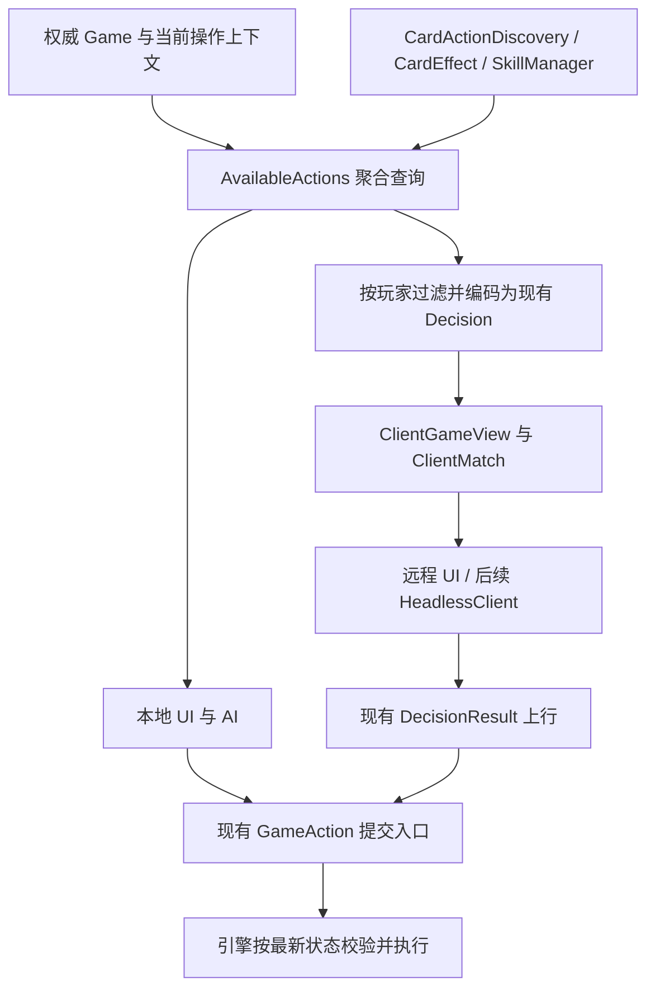

# Phase 15：结构收口方案 v01

本轮为架构咨询：只定向阅读核心入口、动作发现、请求、视图、控制器、移牌与转化实现及直接依赖；未修改代码，未运行测试。以下为实施建议，不构成全项目审计或稳定性验收。Phase 14.1 的检查工具可靠性应继续独立收尾。

## 1. 最值得先解决的问题：动作发现结果仍由多个入口拼装

**选择 AvailableActions，但第一步只统一出牌阶段的查询契约和消费者。** 保留 GameEngine、CardEffect、SkillManager、CardActionDiscovery 和现有 GameAction 执行入口。

当前覆盖不能用一个百分比准确描述，应按能力判断：

| 能力 | 当前依据 | 判断 |
| --- | --- | --- |
| 普通牌、转化牌 | `CardActionDiscovery.actions_for_card/actions_for_sources/actions_in` | 已有主要发现能力，继续复用 |
| 响应、救援 | `response_context/rescue_context/respondable_options/can_respond` | 已有卡牌候选发现；请求是否轮到本人、能否 Pass 仍在其他层 |
| 多素材与装备素材 | `CardActionOption.min_sources/max_sources`、`CardConversion.source_zones/count_for` | 已有未选齐候选及素材约束，不必重新建模 |
| 主动技能 | `SkillManager.can_activate/activatable_skills`、`activation_inputs` | 合理的独立规则提供者，但输出没有与牌动作统一 |
| 重铸 | `RemoteHumanController._recast_view`、AI `_build_action` | 各入口额外拼装，CardActionDiscovery 本身未涵盖 |
| 目标与数量 | Discovery、`PlayerController.legal_targets/target_limits`、Remote `_option_view` | 存在重复查询与不同的参数处理路径 |
| Pass、取消、结束阶段 | Runtime、Decision 约束、本地和远程交互 | 语义不同，尚未形成一致的描述边界 |

最具体的收口理由：`CardEffect.can_use` 已使用动态 `target_rule_for/target_bounds_for`；但 `PlayerController.target_limits` 仍对 MULTIPLE 返回固定 `(1, 2)`，Remote `_option_view` 也读取静态规则并挑样本目标。Discovery 也有直接读取静态 `target_rule` 的路径。这里需要统一调用方式，避免动态技能改了目标上限，而某个入口仍展示旧约束。本轮未运行场景来判定具体技能受影响程度。

主动技能也有同类重复：`Game.start_skill_activation`、Remote `_activatable_skills`、AI `_active_skill_target` 各自处理候选；已有 `activation_inputs` 可以成为共同输入来源。AI 的目标价值排序、保牌和发动偏好属于策略，应保留；只有候选生成、输入数量和合法性判断需要共用。

## 2. 推荐的 Phase 15A：出牌阶段 AvailableActions 契约与接入

### 2.1 只完成一个明确切片

覆盖出牌阶段的普通使用、View-As、主动技能、重铸和结束阶段。接入本地真人、AI 与房主侧 Remote 控制器；客户端继续消费现有 Decision 载荷。

本阶段不迁移嵌套请求、共享无懈和全部响应流程。单人响应与 Pass 的完整接入放到 15B。查询接口允许表示不同 context，但不能把尚未接入的场合宣称为已统一。

建议入口形态：`available_actions(actor, context, selection=None)`，名字可按项目习惯调整。可新增一个小的 `src/game/available_actions.py`，容纳聚合查询和描述类型；不要新建第二份技能注册表、规则注册表或执行引擎。

### 2.2 权威计算与客户端消费分开

客户端可以把 Decision 解析为相同形状的动作描述，但不应拿 RemoteGameView 再跑一套完整规则。普通视图未必包含计算合法动作所需的全部信息。网络上只下发本人获准看到的候选、标识与原因；其他人的手牌、可响应能力和内部规则对象不随动作集合泄露。

### 2.3 AvailableAction 应描述什么

保留内部 `CardActionOption`，通过包装或转换输出统一的纯数据描述，避免另存一份可变规则状态：

| 字段组 | 用途 |
| --- | --- |
| action_id、kind、actor_id、context | 在当前操作上下文内识别一种行为；普通使用、重铸、发动技能彼此区分 |
| source_skill_id、effective_card 描述 | 说明转化或技能来源；结果牌描述不承担实体牌身份 |
| source_candidates、source_bounds | 可选素材、区域与数量；多人未知牌选择继续使用已有不透明 token |
| target_candidates、target_bounds、target_mode | 候选、数量和自行选择/自身/全体等模式；来自动态规则接口 |
| enabled、disabled_reason | 此刻能否进入该行为及原因 |
| complete 或 can_submit | 输入是否齐备；与“能否开始选择”分开 |
| 操作上下文引用 | 有请求时关联现有 request；网络边界关联 match_id、decision request_id、base_revision |

`selection` 是用户当前草稿，不是另一个规则状态。多素材、顺序目标、组合约束由同一查询服务在输入变化时收窄；单个合法目标列表并不保证任意目标组合都合法。

不要枚举所有素材组合与所有目标组合。先描述选择约束，选齐后复核。若某种复杂交互无法由现有载荷准确表达，保留原入口并明确未接入，避免为它顺手扩展整套协议。

现有查询有构造 VirtualCard 的行为，其 id 使用进程计数器。统一接口不要把临时 virtual id 当 action_id，也不应在查询过程中消耗牌、计技能次数、发规则事件或写战报；查询与执行的可观察边界要明确。

### 2.4 两条重要语义

**取消草稿与放弃请求分别处理。** View-As 选到一半按取消，只清输入草稿；Pass 是回答当前请求；取消可选请求由请求约束决定；结束阶段仍走现有回合入口。15A 描述结束阶段及草稿取消能力，15B 再统一响应类控制动作。不要把取消选牌编码为结束回合。

**可发现不代表提交必被接受。** 最终验证留在现有链路：网络由 DecisionRegistry 检查连接身份、请求、候选和格式，Remote 控制器映射为现有 GameAction；GameEngine 的响应入口、UseCardFlow/CardEffect、技能 `resolve_activation` 按最新状态复核。素材转换继续复用 `CardActionDiscovery.validate`。统一这些调用的覆盖，不把 AvailableAction 当成授权凭证，也不另写一份最终规则。

### 2.5 15A 的完成标准（供 Zcode 实施时验证）

- 同一局面、同一操作能力下，本地、AI、Remote 得到相同的动作含义、素材约束和目标范围；显示方式、排序与 AI 选择偏好可以不同。
- 若技能确实 `needs_local_ui`，明确标记该客户端暂不支持；不要伪装成所有入口都能执行，也不要在 15A 迁移其内部交互。
- 普通杀、铁索使用/重铸、单素材转化、丈八双素材、一个带费用和目标的主动技能，以及一个动态目标上限场景形成代表性切片。
- 选牌未完成时可以继续选；取消不扣牌；提交时状态变更仍由引擎拒绝；枚举本身不改变牌区、技能用量和战报。
- 已迁移范围不再保留独立的目标数量硬编码；兼容包装函数允许存在，但只转调共同查询。
- 明确列出未迁移的响应类型和特殊交互，不要求本轮全技能接入。

## 3. Phase 15A 具体涉及哪些模块

| 模块 | 最小改动职责 |
| --- | --- |
| `src/game/available_actions.py`（建议新增） | 描述类型与聚合入口；组合现有规则提供者 |
| `src/game/card_actions/discovery.py`、`option.py` | 继续提供普通牌/转化牌素材与上下文；补足动态目标查询的一致用法 |
| `src/game/skills/activation.py` | 复用并适度补全 `activation_inputs`，作为主动技输入查询来源 |
| `src/game/core.py`、`card_action_session.py` | 出牌阶段入口和技能列表改为消费描述；保留输入草稿及现有提交路径 |
| `src/game/controllers/base.py` | 目标查询和数量接口变为共同查询的兼容包装 |
| `src/game/controllers/ai.py` | 从候选中选择，再做价值排序；保持既有策略，不顺带增强所有技能 AI |
| `src/game/controllers/remote.py` | 将 `_option_view/_recast_view/_activatable_skills/playable_cards` 的重复拼装收进共同查询；这里保留按玩家编码和动作映射 |
| `src/ui/human_control.py`、`remote_control.py`、`view_adapter.py` | 仅按需调整数据读取；保留点击路由、草稿、提示与渲染契约 |

`CardEffect.target_rule_for/target_bounds_for/can_use` 是本阶段依赖的规则权威，不需要为了统一查询重写它们。`SkillManager` 的绑定与生命周期也不改。

网络尽量仍编码为既有 `cards/options/context.activatable/constraints` 字段。AvailableAction 是内部统一契约，不要求立刻成为新的网络消息类型。ViewBuilder 仍负责视图投影，不承担动作执行或重新求解规则。

## 4. 15A 暂时不要碰什么

- GameEngine 调度模型、Flow 父子流程、Pending 栈及结算时序。
- DecisionRegistry 状态流转、ClientMatch 提交确认机制、revision 广播与 LAN 协议。
- ClientGameView 的整体形状、隐藏信息规则、RemoteGameView 的渲染适配职责。
- 具体武将的技能算法、全量技能拆文件、AI 评分策略重写。
- Renderer、布局、动画系统，以及全量实体牌迁移。
- VirtualCard 重命名、Card 改名 PhysicalCard、双实体牌体系或全局 ID 改造。

如果接入时发现这些层有独立缺陷，记录为独立问题；只有阻断本次动作查询切片的最小修复才纳入，并明确说明。

## 5. Phase 15B / C / D 顺序

| 阶段 | 工作 | 进入与结束边界 |
| --- | --- | --- |
| 15B | 请求状态含义与响应动作收口 | 在 15A 描述契约上接入单人响应、救援、选牌/选目标/选项、Pass；明确嵌套与共享请求的状态映射 |
| 15C | 薄 HeadlessClient | 复用 LanSession + ClientMatch + DecisionResult，消费动作描述；无 Renderer 的多客户端自动对局 |
| 15D | 按功能触及范围迁移牌区写入 | 每次只迁移一个实际路径；不设“全量 Atom 化”作为目标，也不成为 15C 的前置条件 |

从现在就采用约定：新增运行时规则不再在任意调用方直接修改牌区；修改旧功能时顺带迁移被修改路径。15D 表示较后开展的专项切片，不表示此前继续新增散落写入。

### 15B：有必要收口语义，暂不必要新建大 RequestFrame

当前真实存在多层状态：

- PendingRequest 的 `status` 与 PendingManager 栈顶共同决定是否能回答。被覆盖的请求仍是 `pending`，暂停含义由栈位置体现。
- Flow 另有 `parent/_children/status`，表达结算等待关系；它与请求栈顺序并非同一棵树，不能简单合并。
- DecisionRegistry 有 OPEN/RESOLVED/CANCELLED/INVALIDATED；有的出牌决策绑定 TurnToken，并没有对应 Engine PendingRequest。
- ClientMatch 有 `decision/_held_decision/answered/waiting_ack/_pending_answer_id`；RemoteDecisionState 还有用户当前选牌草稿。

这些状态有合理分层，但目前依赖多处代码维护映射，值得统一转移入口和只读查询。优先在现有对象上增加明确访问器与少量转移方法，不新增一份需要同步的可变总状态。

建议语义：

| 层 | 状态含义 |
| --- | --- |
| 引擎请求 | WAITING = 栈顶且本人有资格；SUSPENDED = 仍在栈中但被覆盖；终态沿用已解决/取消 |
| 网络登记 | 尚可回答、已接受、已撤销；继续对应现有登记状态 |
| 客户端传输 | 等待所需视图、可提交、SUBMITTING/等待确认、已接受或失效 |
| 本地草稿 | 正在选素材/目标、输入齐备；不参与权威请求终态 |

SUSPENDED 首先可以由栈位置推导，不必新增可写字段。客户端“发过答案”不能将服务器请求标为 RESOLVED；请求回答被消费，也不表示整个 owner Flow 已完成。无请求时不必制造 ANSWERED 状态。

特别保留并明确四个关联：

1. `match_id` 区分对局；引擎 request_id 与网络 decision request_id 不强制相同。
2. 一条共享请求会分发给多名玩家，各自有网络 decision id，并携带 window_id/round_id；不能按一对一重建生命周期。
3. `base_revision` 是客户端展示该决策所需的视图下界。不要要求回答到达时等于全局最新 revision；无关刷新或其他玩家行动不应自动使仍有效的请求作废。
4. 恢复由现有 PendingManager/GameEngine 驱动，网络与客户端重新展示对应决策；恢复、拒绝和 ACK 的重复到达必须幂等。

如果上述收口后仍有多个模块独立修改同一权威转移，才考虑把那个具体转移收进 RequestState；当前证据不足以支持替换整个 Flow/Pending 为新框架。

### 15C：HeadlessClient 应包装现有 ClientMatch

ClientMatch 已持有 ClientGameView、Decision、revision 和 `answer()`；这已是大部分所需底座。建议薄封装提供 `poll()/view/decision/available_actions/answer()/close()`，让自动策略只读本人可见数据并回传选择。

不依赖 RemoteGameView，不初始化 Renderer 或窗口，不构造第二个权威 Game。保持真实网络、拒绝、确认、重同步和关闭流程。已有宿主结算仍需推进 Game.update/动作队列；“无窗口”不等于跳过动画队列中尚存的结算回调，也不等于立即达成完全无 Pygame 依赖。

现在可以定接口，正式实施放在 15A 与 15B 的契约稳定之后；无需等待牌区写入全部迁移、完整回放系统或纯规则引擎抽离。无界面测试仍不能代替真实点击和 Renderer 测试。

### 15D：牌区写入只做渐进收口

本轮未遍历技能，不能声称统计了全部直接写入；在核心入口已确认仍有重要遗留路径：

- `Game.queue_draw_cards` 直接 `hand.append`，本机玩家路径在动画结束时追加。
- `queue_to_discard → discard_card_with_cleanup → Deck.discard` 在动画回调完成时修改弃牌堆。
- `move_source_card_to_processing` 的装备来源路径先移除装备，再直接追加处理区。
- UseCardFlow 仍有临时修改实体牌 nature、弃置时恢复的兼容分支。

Atom 内部和 Deck 底层的容器写入本来就是实现职责，不能把搜索到的所有 append 都视作问题。迁移重点是让调用方走统一的规则入口，并保留装备卸载、失去牌原因、技能通知与时机。不要机械替换为通用 MoveCardAtom 而触发两次事件或跳过卸装效果。

每次被功能修改触及的路径，以原语义为基准补定向验证后迁移。只有在处理具体路径时，才逐步分开规则落位与视觉播放；本阶段不承诺全局守恒或立即重写动作队列。

## 6. 已经够好的结构

- GameEngine + Atom + Flow + Pending：已经具备权威提交、结算暂停与子流程恢复骨架，继续使用。
- PlayerController 的 `present/take_turn/submit`：规则层选择决策来源的边界合理。
- SkillManager 的按玩家绑定、Modifier 与 Conversion 注册：保留机制和文件组织。
- ClientGameView 的按玩家投影、ClientMatch 的单一客户端状态、RemoteGameView 的渲染适配：职责基本成立。
- CardConversion + VirtualCard + ViewAsSession：用户提出的 `name/materials/source_skill` 已由 `name/source_cards/skill_id` 表达。丈八已作为装备授予技能注册同类转换；武圣、龙胆沿用同一转换机制。无需再建一套 VirtualCard 或只为术语统一改名。
- 取消草稿不支付、素材牌负责实际移动、引擎最终复核：这些方向正确；查询契约应接住它们。

VirtualCard 的多素材花色/点数如何定义、旧临时牌属性分支是否覆盖完整，是具体规则问题，留给触及相应功能时校验；不能为了抽象统一直接替换所有行为。

## 7. wmzy/sanguosha 最值得借鉴的三点

1. **动作描述可被无界面策略消费。** 借鉴 AvailableAction 的参数、候选和选择约束；本项目从已有权威查询生成，不照搬客户端规则求解方式。[动作枚举源码](https://github.com/wmzy/sanguosha/blob/main/src/client/headless/availableActions.ts)
2. **Headless 与正常客户端共用视图、连接与提交链路。** 本项目以 ClientMatch 为底座，不另造测试专用协议。[Headless 客户端源码](https://github.com/wmzy/sanguosha/blob/main/src/client/headless/HeadlessGameClient.ts)
3. **验证客户端实际得到的状态。** 将规则结果、视图结果与可继续操作串在同一场景中；继续承接 Phase 14.1，而不是只验规则层血量和手牌。[视图一致性测试](https://github.com/wmzy/sanguosha/blob/main/tests/engine/applyView-consistency.test.ts)

## 8. 最不值得照搬的三点

1. TypeScript/React 的前端技能加载及客户端动作推导机制。本项目已有房主按玩家下发 Decision 的路径，复制这些结构会增加一套规则解释与同步负担。
2. 用 Promise/async atom 等待模式替换目前同步 Pygame 主循环下的 Flow/Pending。它解决的是不同运行模型里的组织问题，当前没有替换收益的证据。
3. 为接近参考项目而全量事件化、Atom 化、逐技能拆文件，或把 Headless/MCP/回放打包成一次改造。本项目应按明确场景减少重复查询，保持每阶段可单独验收。

**实施顺序：15A 出牌动作契约 → 15B 请求及响应语义 → 15C 薄 HeadlessClient → 15D 按需迁移旧牌区写入。**
